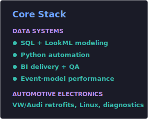

<h1 align="center">Darrian</h1>

  <strong>Business Intelligence &nbsp;•&nbsp; Data Systems &nbsp;•&nbsp; Automotive Electronics</strong>

  I build BI and data engineering systems for large scale operational platforms: SQL, LookML, backend logic, QA workflows, and performance tuning across high volume datasets. Outside of work, I build Linux desktop tools and work on VW/Audi electronics, diagnostics, and reverse engineering.

  
  
  
  
  

  
  

## Selected Automotive Work

| Project | Focus | Link |
| --- | --- | --- |
| RNS850 LAN Activation / Google Earth Restoration | Reverse engineering encrypted scripts and building a stable RNS850-focused LAN activation process | [Write-up](https://www.clubtouareg.com/threads/enabling-rns850-google-earth-via-lan.307124/) |
| Touareg 7P Electronics and Retrofits | Lift, ambient lighting, FlexRay steering research, and router-to-MMI gateway setup | [Build thread](https://www.vwvortex.com/threads/darrian%E2%80%99s-2016-touareg-adventures.9535962/) |
| Audi B5 2.0 Stroker Build | Mechanical work, wiring, ECU, standalone tuning, hardware, and restoration | [Build thread](https://www.vwvortex.com/threads/darrian%E2%80%99s-b5-2-0-stroker-build.9496093/) |

  

